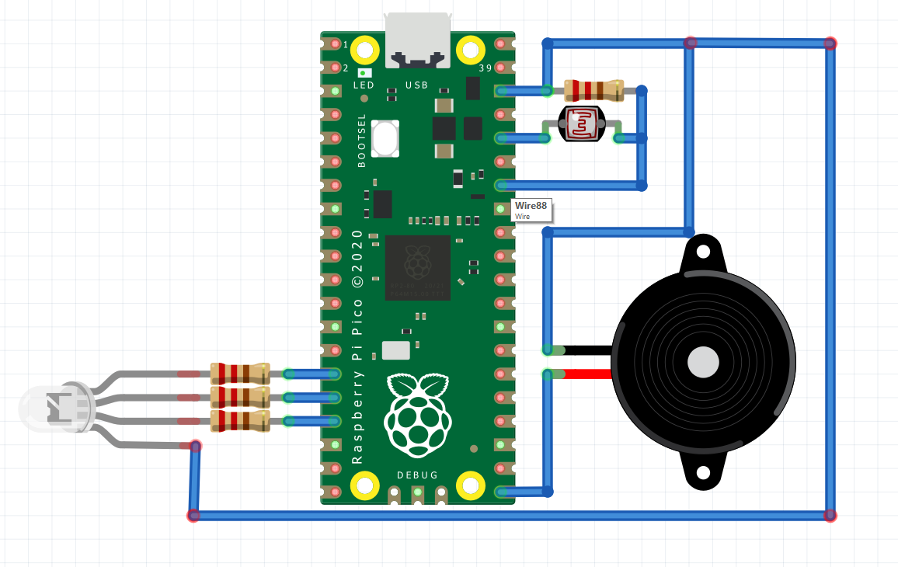
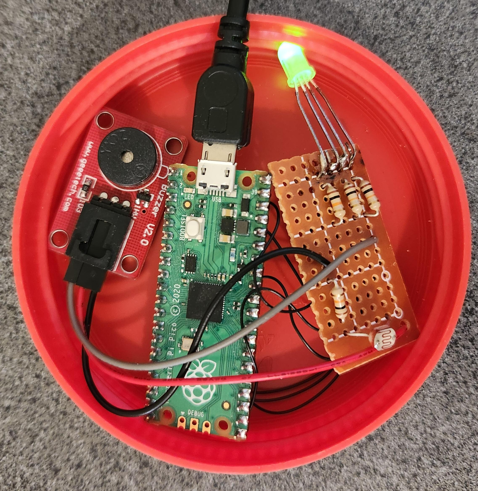

# Smart Coaster
A Raspberry Pi Pico MicroPython smart coaster to help drinking more water

## Materials
- 1x Raspberry Pi Pico
- 4x 10K ohm resistors
- 1x RGB led
- 1x photoresistor
- 1x piezo buzzer

